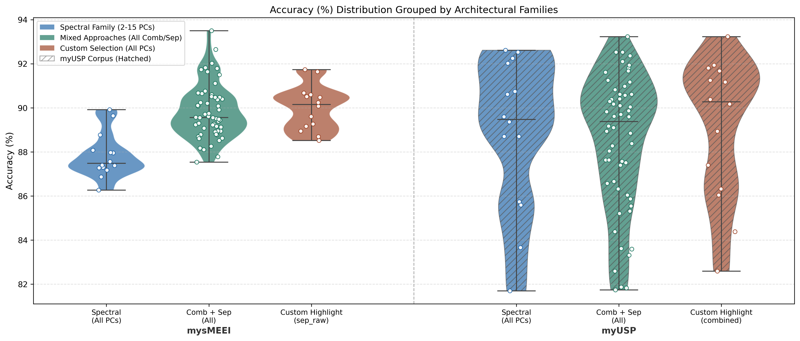
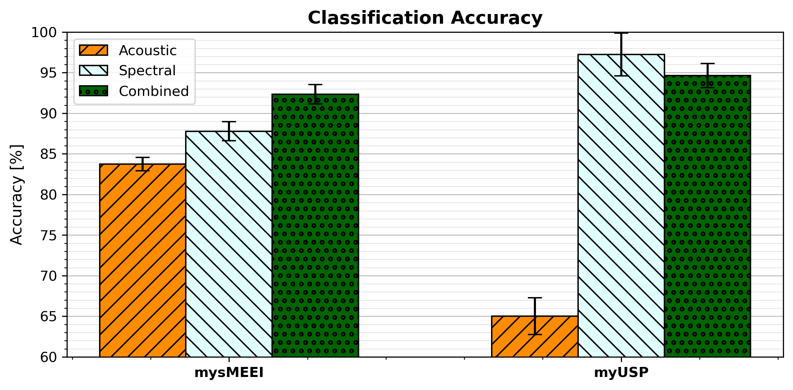
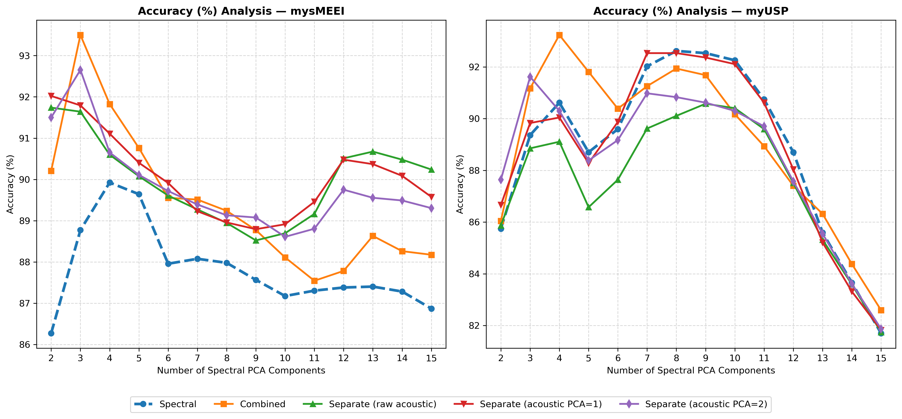
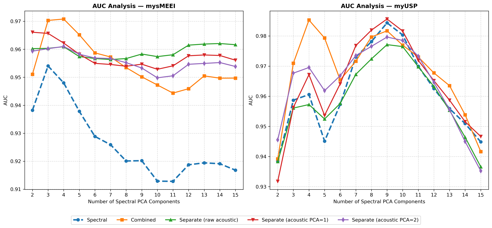
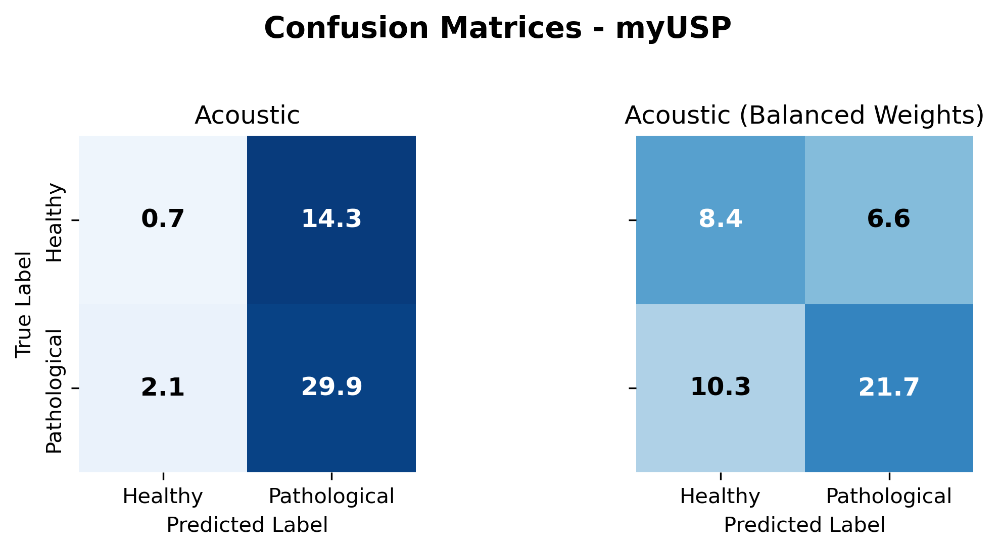

# Spectral and Acoustic Feature Fusion for Pathological Voice Discrimination  
### Intra-Corpus Analysis of Spectral-Acoustic Fusion across the MEEI and USP Corpora

> Machine learning analysis of voice pathology (Reinke's Edema and Vocal Nodules) discrimination using spectral (MFBM) and acoustic features (jitter, shimmer, HNR), exploring intra-dataset fusion dynamics and PCA sensitivity.


---

## Key Highlights

- Combining features **improves mean accuracy by ~2-3 pp** over spectral-only in MEEI
- **Dataset-dependent fusion dynamics** revealed (MEEI vs USP divergence)
- Acoustic features show **high sensitivity to corpus characteristics**
- PCA configuration significantly affects classification stability
- Systematic comparison across **2 datasets + multiple PCA regimes**

---

## Main Result Overview

<p align="center">
  
</p>


> Clear improvement from feature fusion in MEEI, but no clear advantage of fusion is observed in USP.

---

## Quick Performance Snapshot (Article Baseline)

| Dataset | Acoustic Only | Spectral Only | Combined (Fusion) |
| :--- | :---: | :---: | :---: |
| **MEEI** | 83.7% | 87.8% | **92.3%** |
| **USP** | 65.0% | **97.2%** | 94.7% |

---

## What this repository contains

- Standardized feature extraction (Spectral MFBM + Acoustic Parselmouth/Praat)
- Comprehensive PCA-based dimensionality reduction analysis
- SVM classification and validation pipeline
- Comparative intra-dataset analysis (sMEEI vs USP)
- Full replication scripts for experimental reproducibility

---

## Reference Paper

This repository extends the work reported in:

> **"Discriminating Voice Pathologies Through a Combination of Spectral and Acoustic Features"**  
> B. Rodrigues, H. Cordeiro, G. Marques  
> CENTERIS / HCist 2024 — *Procedia Computer Science*, Vol. 256, pp. 835–842, 2025  
> DOI: [10.1016/j.procs.2025.02.185](https://doi.org/10.1016/j.procs.2025.02.185)

The implementation of the original paper is available [here](https://github.com/Bruno21511/paper-voice-pathology-mfbm-acoustic-fusion):

The present work expands the original study by applying the methodology to a second 
dataset (USP), exploring additional PCA configurations, and analysing the stability 
of spectral-acoustic feature fusion across datasets.

A follow-up inter-corpus extension study is available here: [LINK]

---

## Methodological Note

All results presented in this repository were obtained using the current implementation.

Minor differences may occur when re-running the notebooks due to:
- code refactoring,
- random seed handling,
- and cross-validation variability.

Results may be reported as:

- **mean ± standard deviation**, when obtained across cross-validation folds;
- a single mean value, when representing averages across experiments;
- or a single experiment result.

Although accuracy is the primary reported metric, Area Under the Curve (AUC) is also included whenever it provides additional insight. Other metrics (Precision, Recall and F1-score) are available in the `results/metrics` folder.

Rather than focusing exclusively on maximising classification accuracy, this repository also investigates:

- the interaction between spectral and acoustic information,
- the influence of dimensionality reduction,
- and the stability of classification performance across datasets and configurations.

---

## Table of Contents

1. [Overview](#1-overview)
2. [Repository Structure](#2-repository-structure)
3. [Datasets](#3-datasets)
   - [3.1 sMEEI Subset](#31-smeei-corpus)
   - [3.2 USP Corpus](#32-usp-corpus)
4. [Experiments](#4-experiments)
   - [4.1 General Methodology](#41-general-methodology)
   - [4.2 Article Configuration](#42-article-configuration)
   - [4.3 PCA Component-Based Configurations](#43-pca-configurations)
   - [4.4 Acoustic-Only Results Analysis](#44-acoustic-only-results-analysis)
5. [Conclusions](#5-conclusions)
6. [Limitations](#6-limitations)
7. [Usage](#7-usage)
8. [References](#8-references)

---

## 1. Overview

This work addresses the following research question:

> Does combining spectral and acoustic parameters consistently improve the 
> discrimination of healthy speakers (Control) and speakers with physiological 
> laryngeal pathologies (PhLP) across different corpora?

The original paper reported a **clear advantage of feature fusion in the MEEI corpus**. 
The experiments conducted here partially replicate that finding, but also reveal 
important corpus-dependent differences that qualify its generality.

The results show a consistent advantage of feature fusion in the sMEEI dataset. 
In the USP dataset, however, spectral features alone achieve comparable performance, 
suggesting that the benefit of combining acoustic and spectral information is 
conditioned by the **discriminative power of the acoustic feature set** in each corpus.

### Main Findings

- Spectral features consistently outperformed acoustic-only configurations.
- The discriminative power of acoustic parameters varied substantially between datasets, achieving considerably stronger results in the MEEI subset than in the USP corpus.
- Combining spectral and acoustic features improved performance in the MEEI subset.
- The same behaviour was not consistently observed in the USP dataset.
- The optimal PCA dimensionality differed between datasets.
- The benefit of feature fusion appeared to be dataset-dependent and closely related to the discriminative power of the acoustic feature set.

---

## 2. Repository Structure

```
├── data/
│   ├── mysMEEI
│   │   └── mysMEEI.csv                	# Metadata (filename, age, gender, class label)
│   │   └── mysMEEI_stats.csv           # Stats (total and per class age and gender distribution)
│   │ 
│   ├── myUSP
│   │   └── myUSP.csv                	  # Metadata (filename, age, gender, class label)
│   │   └── myUSP_stats.csv             # Stats (total and per class age and gender distribution)
│   │ 
│   └── processed/
│       └── mysMEEI.parquet             # Pre-extracted features (no audio signals)
│       └── myUSP.parquet               # Pre-extracted features (no audio signals)
│
├── notebooks/
│   ├── 01_feature_extraction.ipynb     # Spectral and acoustic feature extraction
│   └── 02_analysis.ipynb               # Classification, cross-validation, results
│
├── results/
│   ├── figures/                        # Plots and visualisations
│   └── metrics/                        # Accuracy tables, confusion matrices and per-class metrics
│
├── src/                            # Source code modules
│   ├── data/                       # Data loading and dataframe handling
│   ├── features/                   # Signal processing and feature extraction
│   ├── analysis/                   # Statistical analysis and feature evaluation
│   ├── evaluation/                 # Classification metrics and evaluation utilities
│   └── visualization/              # Plotting and figure generation
│
├── tests/                          # Unit tests
│
├── .github/
│   └── workflows/
│       └── ci.yml                  # Continuous integration pipeline
│
├── build_dataset.py                # Script to download/arrange raw data and metadata
├── main.py                         # Main entry point to run full experiments and pipeline
├── config.yaml                     # Project configuration and experiment parameters
├── pytest.ini                      # Pytest configuration
├── .gitignore
├── LICENSE
├── README.md
└── requirements.txt
```

---

## 3. Datasets

### 3.1 sMEEI Corpus

The audio signals used in this work are a subset of the **Massachusetts Eye and Ear Infirmary (MEEI)** Voice Disorders Database, commercialised by Kay Elemetrics Corp.

The subset used in this repository is based on the one (sMEEI) previously employed in [[1]](#8-references), with the following modifications:

- the Unilateral Vocal Fold Paralysis (UvfP) class was discarded;
- only the Reinke's Edema and Vocal Nodules pathological classes were retained;
- both pathological classes were merged into a single class designated as **Physiological Laryngeal Pathologies (PhLP)**.

This selection was performed to ensure compatibility with the USP dataset, which contains the same pathological categories.

| Class | Description | N |
|---|---|---|
| Control | Healthy speakers | 36 |
| PhLP | Physiological laryngeal pathologies (Reinke's Edema + Vocal Nodules) | 56 |
| **Total** | | **92** |

All signals contain sustained vowel /a/ phonations sampled at 25 kHz using 16-bit PCM encoding. One recording per speaker was used, with no stratification by age or gender.

The audio files are **not included** in this repository because the MEEI database is a commercial product.

#### Known Limitations of the MEEI Database

Although widely used in pathological voice analysis research, the MEEI database presents known methodological limitations that should be considered when interpreting classification results. These limitations are discussed in the literature, namely by Saenz-Lechon et al. (2006), and are acknowledged here as a limitation of the present work.

### 3.2 USP Corpus

The second dataset used in this work belongs to the **Universidade de São Paulo (USP)** voice corpus, previously used in [[2]](#8-references).

To ensure compatibility with the sMEEI subset, the same class selection procedure was adopted:

- the Neurological Conditions (neuro) class was discarded;
- only the Reinke's Edema and Vocal Nodules pathological classes were retained;
- both classes were merged into the **Physiological Laryngeal Pathologies (PhLP)** group.

Only sustained vowel /a/ recordings were used.

| Class | Description | N |
|---|---|---|
| Control | Healthy speakers | 15 |
| PhLP | Physiological laryngeal pathologies (Reinke's Edema + Vocal Nodules) | 32 |
| **Total** | | **47** |

Signals have a minimum duration of 2 seconds and were sampled at 22050 Hz. The audio files are **not included** in this repository due to distribution restrictions.

---

## 4. Experiments

Except for the PCA configuration stage, all experiments followed the same general processing pipeline.

### 4.1 General Methodology

#### a) Pre-processing

- DC removal and peak normalisation was applied to all signals.
- Silence at signal boundaries was removed using an energy-threshold method based on [[3]](#8-references).
- Signal duration was limited to the shortest recording present in the entire dataset collection, ensuring homogeneous input length across all samples.

#### b) Spectral Feature Extraction

Spectral features were extracted from sustained vowel /a/ recordings using a Mel-frequency filterbank.

Processing steps:

- Framing: 30 ms windows with 10 ms step
- Windowing: Hann window applied to reduce spectral leakage
- Boundary handling: first and last two frames discarded to mitigate possible onset/offset instabilities
- FFT: 2048-point FFT computed per frame
- Mel filterbank: 20 triangular filters, unit-area normalisation, uniformly spaced on the Mel scale, frequency range 0–4 kHz

For each Mel band, the mean and standard deviation across frames were computed, producing one 20-dimensional mean vector and one 20-dimensional standard deviation vector. The final 8 dimensions were discarded, as preliminary analysis suggested limited discriminative relevance in higher-frequency bands.

#### c) Acoustic Feature Extraction

Acoustic parameters were extracted using Parselmouth (Python interface to Praat) [[4]](#8-references):

- Jitter (%)
- Shimmer (%)
- Harmonic-to-Noise Ratio (HNR)

A log10 transformation was applied to Jitter and Shimmer to reduce distribution skewness and improve approximate normality. The final acoustic representation is a 3-dimensional feature vector.

#### d) Feature Scaling and PCA

Feature standardisation was performed using `StandardScaler`, fitted exclusively on training data and subsequently applied to training and test data.

PCA was explored using multiple configurations in order to reduce feature dimensionality, study the interaction between spectral and acoustic information, and evaluate classifier stability across representations.

#### e) Classification

Classification was performed using a Support Vector Machine (SVM) with RBF kernel using Scikit-learn default parameters.

Validation procedure:

- Stratified 5-fold cross-validation
- 100 iterations for for each configuration
- Unique random state used in each iteration

Reported metrics: Accuracy (mean ± standard deviation) and Area Under the ROC Curve (AUC). Additional metrics are available in the `results/metrics` folder.

---

### 4.2 Article Configuration

This experiment reproduces the PCA configuration used in the original paper.

#### 4.2.1 PCA Configuration

PCA was applied independently to different spectral regions:

| Feature block | PCA configuration |
|---|---|
| Mean MFBM bands 1–6 | 2 PCs retained |
| Mean MFBM bands 7–12 | 1 PC retained |
| Std MFBM bands 1–6 | 2 PCs retained |
| Std MFBM bands 7–12 | 1 PC retained |
| Acoustic features | No PCA applied |

This configuration resulted in 6 spectral principal components, plus 3 acoustic parameters in the combined configuration.

#### 4.2.2 Results and Discussion

<p align="center">
  
</p>

| Metric | Acoustic | Spectral | Combined |
|---|---|---|---|
| MEEI Accuracy | 83.7 ± 0.8 | 87.8 ± 1.2 | **92.3 ± 1.2** |
| MEEI AUC | 0.878 ± 0.006 | 0.933 ± 0.009 | **0.962 ± 0.004** |
| USP Accuracy | 65.0 (*) ± 2.3 | **97.2 ± 2.6** | 94.7 ± 1.5 |
| USP AUC | 0.621 ± 0.044 | **0.997 ± 0.004** | 0.990 ± 0.005 |

The MEEI subset shows a clear advantage when combining spectral and acoustic parameters. Both accuracy and AUC increased relative to the spectral-only configuration, suggesting that acoustic parameters provide complementary discriminative information in this dataset.

In the USP subset, the opposite behavior was observed, with the spectral-only configuration achieving the highest performance. Both accuracy and AUC slightly decreased after adding acoustic parameters, suggesting that acoustic parameters do not provide complementary value for this dataset and may instead introduce redundancy to an already highly discriminative spectral baseline.

> **(\*)** The acoustic-only USP result should be interpreted with caution. The classifier largely collapsed into predicting the pathological class for nearly all samples, and the obtained accuracy mainly reflects the dataset class imbalance rather than meaningful discriminative capability. This is further supported by the low AUC value (0.614).

To further investigate the interaction between spectral and acoustic features, a broader set of PCA configurations was evaluated.

---

### 4.3 PCA Configurations

#### 4.3.1 Methodology

Several PCA-based configurations were evaluated to analyse the influence of dimensionality reduction on both spectral and acoustic feature spaces, as well as their interaction in a combined representation.

| Configuration | Description |
|---|---|
| **Acoustic only** | No PCA applied. Baseline acoustic representation (jitter, shimmer, HNR). |
| **Spectral only** | PCA applied exclusively to spectral features. Number of PCs varied from 2 to 15. |
| **Combined** | PCA applied jointly to all features concatenated before reduction. |
| **sep_raw** | PCA applied to spectral features only. Acoustic features kept unchanged. |
| **sep_a1** | PCA applied separately to spectral features. Acoustic features reduced to 1 PC. |
| **sep_a2** | PCA applied separately to spectral features. Acoustic features reduced to 2 PCs. |

For all PCA-based configurations, the number of retained spectral principal components was systematically varied between 2 and 15.

#### 4.3.2 Results and Discussion

<p align="center">
  
</p>

<p align="center">
  
</p>


The figures reveal a clear difference in behaviour between the two datasets.

In the sMEEI dataset, the best-performing configuration for nearly all numbers of spectral principal components is consistently one that includes both spectral and acoustic information. This pattern provides strong evidence that feature fusion is beneficial in this dataset, as the addition of acoustic parameters systematically improves classification performance across PCA configurations.

In contrast, the USP dataset exhibits less consistent behaviour. While multimodal configurations occasionally achieve the best performance, there are several cases in which spectral-only configurations match or even outperform the combined approaches. This suggests that acoustic features do not contribute consistently to class separability in this corpus.

Another relevant difference concerns the location of performance peaks: a broader sweep of PCA component counts (2 to 15 spectral PCs) reveals a consistent two-peak pattern in both corpora. Performance first peaks at a low number of components (3–4 PCs), then dips slightly before recovering to a second, lower local peak, before degrading steadily as more components are retained.

This behaviour is consistent with the curse of dimensionality: as the feature space grows relative to the number of available samples, the classifier increasingly overfits noise rather than signal. Critically, the onset of sustained degradation occurs earlier in the USP subset than in MEEI, which aligns with the smaller sample size of USP (47 subjects) compared to MEEI (92 subjects). With fewer training samples, the effective dimensionality budget before overfitting sets in is correspondingly lower.

**Accuracy summary across datasets (%)**

| Dataset | Acoustic | Spectral | Combined | sep_raw | sep_a1 | sep_a2 |
|---|---|---|---|---|---|---|
| MEEI | 84.2% | 87.8% | 89.4% | 90.0% | **90.1%** | 89.8% |
| USP | 64.5% | 88.8% | **89.1%** | 87.6% | 88.8% | 88.4% |

The results confirm a consistent advantage of multimodal feature representations in the sMEEI dataset: every multimodal configuration (combined, sep_raw, sep_a1, sep_a2) outperforms the spectral-only baseline in both accuracy and AUC, with sep_a1 achieving the best overall accuracy (90.1%).
In the USP dataset, only the combined configuration achieves a clear improvement over the spectral-only baseline, in both accuracy (+0.3%) and AUC (+0.007). The remaining multimodal configurations match spectral-only accuracy at best (sep_a1: 88.8%) or underperform it (sep_raw, sep_a2). 

**Detailed results by number of spectral components**

*MEEI:*

| spec_pca | spectral_acc | mean_comb_acc | best_comb_acc | sep_a1_acc |
| :---: | :---: | :---: | :---: | :---: |
| 2 | 86.3% | 91.4% | **92.0%** | **92.0%** |
| 3 | 88.8% | 92.4% | **93.5%** | 91.8% |
| 4 | 89.9% | 91.0% | **91.8%** | 91.1% |
| 5 | 89.6% | 90.3% | **90.8%** | 90.4% |
| 6 | 88.0% | 89.7% | **89.9%** | **89.9%** |
| 7 | 88.1% | 89.4% | **89.5%** | 89.2% |
| 8 | 88.0% | 89.1% | **89.2%** | 89.0% |
| 9 | 87.6% | 88.8% | **89.1%** | 88.8% |
| 10 | 87.2% | 88.6% | **88.9%** | **88.9%** |
| 11 | 87.3% | 88.7% | **89.5%** | **89.5%** |
| 12 | 87.4% | 89.6% | **90.5%** | **90.5%** |
| 13 | 87.4% | 89.8% | **90.7%** | 90.4% |
| 14 | 87.3% | 89.6% | **90.5%** | 90.1% |
| 15 | 86.9% | 89.3% | **90.2%** | 89.6% |

*USP:*

| spec_pca | spectral_acc | mean_comb_acc | best_comb_acc | combined_acc |
| :---: | :---: | :---: | :---: | :---: |
| 2 | 85.7% | 86.6% | **87.6%** | 86.0% |
| 3 | 89.4% | 90.4% | **91.6%** | 91.2% |
| 4 | 90.6% | 90.7% | **93.2%** | **93.2%** |
| 5 | 88.7% | 88.8% | **91.8%** | **91.8%** |
| 6 | 89.6% | 89.3% | **90.4%** | **90.4%** |
| 7 | 92.0% | 91.1% | **92.5%** | 91.3% |
| 8 | **92.6%** | 91.4% | 92.5% | 91.9% |
| 9 | **92.5%** | 91.3% | 92.4% | 91.7% |
| 10 | **92.3%** | 90.7% | 92.1% | 90.2% |
| 11 | **90.7%** | 89.7% | 90.6% | 88.9% |
| 12 | **88.7%** | 87.6% | 88.0% | 87.4% |
| 13 | 85.6% | 85.6% | **86.3%** | **86.3%** |
| 14 | 83.7% | 83.7% | **84.4%** | **84.4%** |
| 15 | 81.7% | 82.0% | **82.6%** | **82.6%** |

In the sMEEI dataset, spectral-only configurations consistently underperform multimodal configurations across all numbers of retained principal components, reinforcing that acoustic information contributes positively when properly integrated.

In the USP dataset, the behaviour is markedly different. For lower numbers of spectral components (2–7), multimodal configurations tend to perform better. As the number of spectral components increases (8–12), spectral-only configurations begin to dominate, suggesting that higher-dimensional spectral representations already capture sufficient class-discriminative structure on their own, reducing the relative benefit of adding acoustic features.

From 13 components onward, all configurations degrade steadily, consistent with the curse of dimensionality discussed above. This degradation is not uniform, however: the jointly-reduced combined configuration, which retains exactly as many total dimensions as spectral-only (PCA being applied to spectral and acoustic features together), keeps matching or slightly exceeding spectral-only performance in this range. In contrast, separate strategies that add acoustic features on top of the already extracted spectral PCs (thereby increasing the total column count relative to the same PC index) suffer from the extra dimensionality, entering the overfitting regime slightly earlier as a result.

This dimensionality effect, observed consistently across both corpora, underscores the practical necessity of dimensionality reduction techniques, such as the PCA-based approach adopted here, when working with high-dimensional spectral representations and comparatively small sample sizes.

Overall, these results highlight that the effectiveness of feature fusion is not only dataset-dependent, but also dependent on the dimensionality of the spectral representation itself.

---

### 4.4 Acoustic-Only Results Analysis

The following results present the classification performance obtained using only acoustic parameters, without any spectral information.

| Dataset | Metric | Default Weights | Balanced Weights |
| :--- | :--- | :---: | :---: |
| **sMEEI** | Accuracy (%) | 83.7 ± 0.8 | **84.6 ± 1.2** |
| | AUC | **0.878 ± 0.006** | 0.871 ± 0.008 |
| **USP** | Accuracy (%) | **65.0 ± 2.3** | 64.1 ± 4.0 |
| | AUC | 0.621 ± 0.044 | **0.667 ± 0.032** |

The results clearly show a strong discrepancy in the discriminative power of acoustic parameters between the two datasets.

In the sMEEI dataset, acoustic features alone achieve relatively high classification performance, with an average accuracy of 83.7% and an AUC of 0.878. Switching to balanced class weights barely changes these results (84.6% accuracy, 0.871 AUC), suggesting that the classifier does not suffer meaningfully from class imbalance in this dataset and that the default weighting is already adequate.

In contrast, the USP dataset shows markedly weaker performance. Here, balanced class weights do not improve accuracy (64.1% vs. 65.0%) but produce a clear gain in AUC (0.667 vs. 0.621). This suggests that balanced class weights do improve the model's underlying ability to separate the two classes, even though that improvement does not translate into a higher accuracy at the default decision threshold.

To investigate this ambiguous result in the USP dataset further, the confusion matrices for both the default and balanced weight configurations are presented below.

<p align="center">
  
</p>

The confusion matrices confirm this pattern directly. Without balanced weights, the classifier almost entirely fails to identify the healthy class: of the 15 healthy subjects on average, only 0.7 are correctly classified, against 14.3 misclassified as pathological. The pathological class fares better, with 29.9 of the 32 subjects correctly identified.

With balanced class weights, these errors are redistributed rather than resolved: healthy classification improves (8.4 correct vs. 6.6 misclassified), but pathological classification worsens (21.7 correct vs. 10.3 misclassified). The classifier becomes less biased towards a single class, but not more accurate overall. Both classes now show substantial misclassification, reinforcing that the underlying issue is a fundamental lack of discriminative information in the acoustic feature set for this dataset, rather than class imbalance alone.

---

## 5. Conclusions

The results of this study indicate that combining spectral and acoustic parameters can improve the discrimination between healthy speakers and speakers with physiological laryngeal pathologies. However, this benefit is not universal and appears to depend strongly on the discriminative quality of the acoustic feature set.

When acoustic parameters carry meaningful class-related information, as observed in the sMEEI dataset, feature fusion leads to consistent performance improvements across configurations. In this case, acoustic features provide complementary information to spectral representations.

In contrast, when acoustic features exhibit weak or inconsistent discriminative capability, as observed in the USP dataset, their contribution becomes limited. In such scenarios, spectral-only representations achieve comparable or higher performance across several configurations.

In practical terms, these findings indicate that spectral-acoustic feature fusion should be viewed as a dataset-dependent strategy whose benefits must be verified experimentally rather than assumed beforehand.

Beyond the fusion question, the broader PCA sweep also revealed a consistent dimensionality effect: performance in both corpora degrades once too many spectral components are retained, with this onset occurring earlier in the smaller USP subset: a reminder that feature-space size must be considered relative to available sample size, not evaluated in isolation.

---

## 6. Limitations

Several limitations should be considered when interpreting the results of this study.

The MEEI corpus is known in the literature to present methodological constraints, which may affect the generalisability of the results obtained in this work (see [Section 3.1](#31-smeei-corpus)).

Although no specific methodological issues are reported for the USP corpus, its relatively small size (47 subjects) represents an important limitation, reducing statistical robustness and increasing sensitivity to inter-subject variability.

A further limitation relates to the discriminative power of the acoustic parameters in the USP dataset. It remains unclear whether this is due to intrinsic subject characteristics, recording conditions, or the feature extraction process itself, which relies on a third-party tool. This introduces uncertainty regarding the reliability of acoustic features in this context.

The use of PCA-based dimensionality reduction introduces additional complexity. PCA transforms the original feature space into components that are less directly interpretable in terms of bioacoustic meaning, reducing transparency and introducing dataset-dependent variability in the resulting representations.

Finally, all experiments were conducted using sustained vowel /a/ phonations. The extent to which these findings generalise to other phonemes or continuous speech remains an open question.

---

## 7. Usage

### Requirements

See requirements.txt for dependencies.

### Quick start (recommended)

#### Option A — Starting from pre-extracted features

If you already have the processed parquet file (included in this repo under `data/processed/`), simply run:
python main.py

This reproduces all paper results: classification metrics, confusion matrices, and figures, saved to `results/metrics/` and `results/figures/`.

#### Option B — Starting from raw audio files

Place the audio corpus outside the repository, following the structure below:

```
parent_directory/
├── voice-pathology-mfbm-acoustic-fusion-intracorpus/
└── corpora/
    ├── mysMEEI/
    │   ├── control/
    │   │   └── *.wav
    │   ├── edema/
    │   │   └── *.wav
    │   ├── uvfp/
    │   │   └── *.wav
    │   ├── nodulo/
    │   │   └── *.wav
    │   └── mysMEEI.csv              # Audio corpus metadata (filename, age, gender, group)
    │
    └── myUSP/
        ├── control/
        │   └── *.wav
        ├── edema/
        │   └── *.wav
        ├── neuro/
        │   └── *.wav
        ├── nodulo/
        │   └── *.wav
        └── myUSP.csv              # Audio corpus metadata (filename, age, gender, group)
```

**Note**: The corpus directory is configured separately from the repository to avoid storing large audio files in version control.

Run the two steps in order:<br><br>
python build_dataset.py<br>
python main.py

### Interactive exploration (notebooks)

For step-by-step exploration, visualization, and the figures used in the README, open and run the notebooks in order:

- `notebooks/01_features_extraction.ipynb` — feature extraction (requires raw audio corpus)
- `notebooks/02_analysis.ipynb` — classification and analysis (requires only the processed parquet file)
<br><br>

**Configuration**: Before running the pipeline, check or adjust the dataset names, paths, and extraction parameters in the `config.yaml` file located at the root of the project.

---


## 8. References

[1] B. Rodrigues, H. Cordeiro, G. Marques, "Discriminating Voice Pathologies Through a Combination of Spectral and Acoustic Features," *Procedia Computer Science*, vol. 256, pp. 835–842, 2025. DOI: [10.1016/j.procs.2025.02.185](https://doi.org/10.1016/j.procs.2025.02.185)

[2] B. Rodrigues, H. Cordeiro, G. Marques, "Bandas espectrais de energia para discriminação de patologias laríngeas em sinais de fala," *18th Iberian Conference on Information Systems and Technologies (CISTI)*, Aveiro, Portugal, June 2023. DOI: [10.23919/CISTI58278.2023.10212052](https://doi.org/10.23919/CISTI58278.2023.10212052)

[3] L. Lamel, L. Rabiner, A. Rosenberg, J. Wilpon, "An Improved Endpoint Detector for Isolated Word Recognition," *IEEE Transactions on Acoustics, Speech and Signal Processing*, 1981.

[4] Y. Jadoul, B. Thompson, B. de Boer, "Introducing Parselmouth: A Python Interface to Praat," *Journal of Phonetics*, 2018.

---

## License

This project is licensed under the MIT License — see the [LICENSE](LICENSE) file for details.